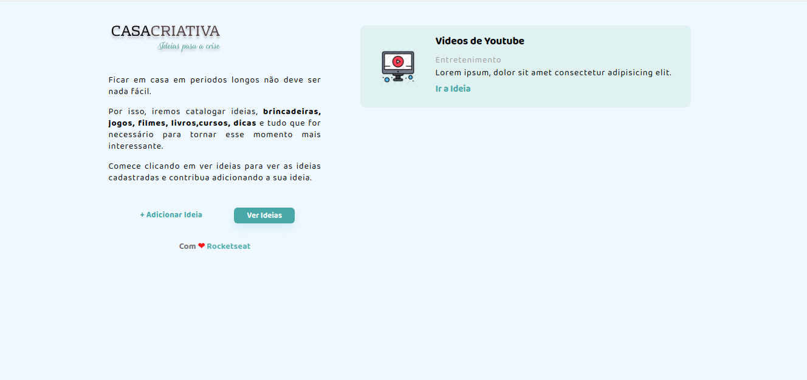
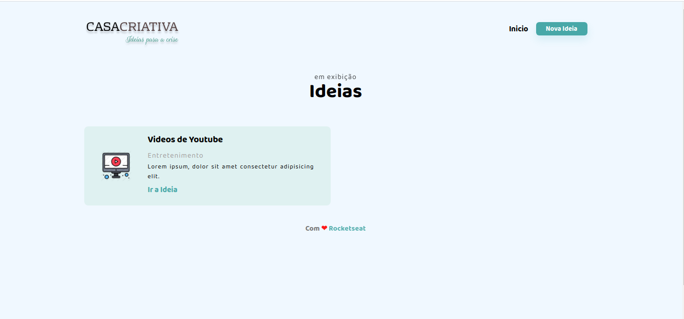
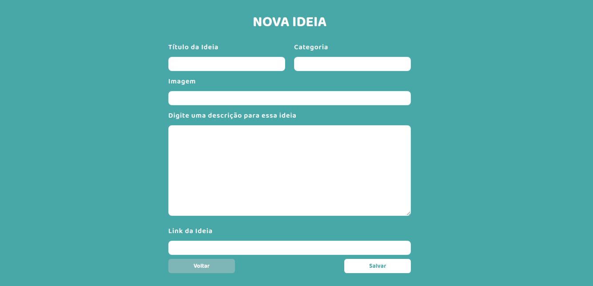

<p align="center"> 

</p>

# Casa Criativa - WorkshopDev 

_Aplicativo desenvolvido para registrar idéias criativas para realizar em casa durante a quarentena da pandemia do COVID-19._

_Funcionalidade - colecionar idéias criativas através de um registro (de um site externo) para posteriormente filtrar as atividades registradas por interesse._

<p align="center"> 

</p>

<p align="center"> 

</p>

<p align="center"> 

</p>

# Iniciar 🚀

_Estas instruções te permitirão obter uma copia do projeto em funcionamento em sua máquina local para propósitos de desenvolvimento e provas._

## Pré-requisitos 📋


### Clonar o repositório
git clone https://github.com/allyneromanosque/casacriativa


## Instalação através do terminal 🔧
``` bash
#Navegar até o diretório 
cd casacriativa

#Baixar as dependências com o comando 
npm i

#Executar o servidor 
npm run dev
```
A seguir abra o seu navegador e acesse http://localhost:3000/


## Tecnologias utilizadas 🛠️

- JavaScript
- HTML
- CSS
- Node.js
- Express
- SQLite3
- Nunjucks

## Licença 📄

Este projeto está sob a linceça MIT. - veja o aquivo [license txt](license.txt) para detalhes

## Gratidão 🎁

* **Rocketseat** - *Plataforma de Educação e Tecnologia* - [Roketseat](https://github.com/rocketseat)
* **Mayk Brito** - *Instrutor* - *Desenhador da Interface* - [Mayk Brito](https://github.com/maykbrito)


---
⌨️ com ❤️ por [Allyne Romanosque](https://www.linkedin.com/in/allyneromanosque/) 😊